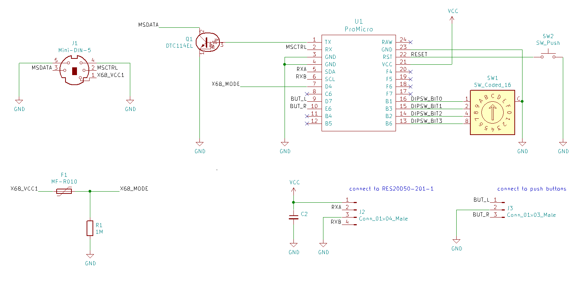

# Horizontal paddle controller
Yet Another XPDL-1

## What's this
左右ボタンとX軸しかない光学エンコーダ式マウスです。  
X68000用キャメルトライに付属していたXPDL-1を代替するのが主目的です。  
(ですが、作者の手元にあるキャメルトライの媒体はカビており、まだ試せていません)

## おことわり
例によって完全無保証です。  
他の方のアレの方が良かった、大切なX68000が壊れた、などといわれても何もできません。  
これを使う/使わないを判断する最終責任は貴方にあります。  
そして、その結果が意図しないものであったとしても、同様にその責は貴方自身が負うことになります。

## 特徴
- 回転方向/倍率変更スイッチ
- X68000のマウス端子またはUSB接続の選択式

## 弱点
- 加速度については全く考慮されていない
- 他のマウスとの同時接続はできない
- 消費電力が大きいため、X68000のマウス端子接続の場合でもUSB端子への給電が必要
- 作者の作業環境と視力とプログラミング能力と口座残高に深刻な問題がある

その他既知の不都合については [issues](./issues) を確認ください。

## 設定変更方法
### 回転方向設定・倍率変更スイッチ
16進ロータリーDIPスイッチで設定します。
```
// ロータリーDIPSW指示値   0   1   2   3   4   5   6   7   8   9   A   B   C   D   E   F
//              X軸倍率  +1  +2  +3  +4  +5  +6  +7  +8  -8  -7  -6  -5  -4  -3  -2  -1
```

### 左右ボタンの入れ替え
そんな機能はありません。以下のいずれかで対応してください。
- コントローラを180度回転して左右逆に持ち替える
- ボタンの配線を入れ替える
- ソースのボタン定義を入れ替える

## 回路図


## 回路製作時の留意点
- 部品点数を減らすため、Arduinoは5V版を前提としています。
- X68000接続時でもX68000本体からの電源は使わず、USBから電源を供給することを推奨します。
- ロータリーエンコーダは飽和波形(saturated wave)ではなく、矩形波(square wave)として出力が得られるものを選定してください。
- ロータリーエンコーダの電源電圧、およびI/O電圧は5Vのものを選定してください。
- 16進ロータリーDIPスイッチの半田付けの際には特定のスイッチ位置に合わせておく必要があります。  
  データシートで確認してください。

## プログラムのビルド
arduino IDE のライブラリマネージャから以下のライブラリを取得した後、スケッチをビルドしてください。
- Encoder  
  https://www.pjrc.com/teensy/td_libs_Encoder.html

## プログラム書き込み時の注意
プログラム書き込み時には必ず本回路をX68000から取り外してください。

## 消費電力についての参考情報
X68000本体の電源は昨今のPC電源に比べかなり貧弱です。  
本回路は最大60mAを消費しますが、純正のマウスはこれの半分以下しか消費しません。

## 謝辞
- X68000側のマウス関連コードは、たねけん様(@taneken2000)のUSBKBD2X68Kを参考にしています。  
  ソースコードが開示されていなければ、そもそもこれを作ろうとは思わなかったでしょう。

- 回路図の作成には [KiCad](https://kicad.org/) を用いました。  
  この出来のCADが個人で手軽に使えるようになったのは素晴らしいことです。  
  プロジェクトに参画されている皆様に感謝します。
